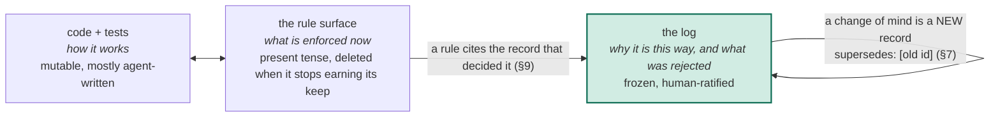
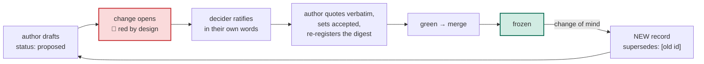

# Append-only Architecture Decision Records

**A specification for the human-ratified decision log of a repository that agents write.**

| | |
|---|---|
| Status | draft 1 |
| Record format this edition specifies | `schema: 1` |
| Conformance keywords | MUST, MUST NOT, SHOULD, SHOULD NOT, MAY, as in RFC 2119 |
| Reference implementation | this repository: `docs/adr/`, `tools/adr-gate.sh`, `.github/workflows/adr-gate.yml` (non-normative, Appendix A) |

## 1. The problem

Where is the source of truth for how a piece of software is supposed to work,
once agents fix whatever they touch and keep undoing decisions nobody wrote
down? Tests do not carry the fact that four seemingly valid options were
rejected before the fifth was chosen. Another document is another thing that
drifts.

This specification splits the question. *How it works* is the code and its
tests, which agents edit freely, and nothing an agent can edit proves what a
human meant. *Why it works this way, and what was rejected* is a decision, and
decisions live in an append-only log of records in the same repository. A
record merges only with the decider's words quoted verbatim, a gate makes any
edit to a merged record unmergeable, and a change of mind is a new record that
supersedes the old one.

A frozen record cannot drift, because it is history rather than current state.
The rules that are enforced now cite the record that decided them, so a reader
reaches the decider, the date and the rejected options without asking anyone.

## 2. Terms

| Term | Meaning |
|---|---|
| **Log** | every record in a repository, plus the registry |
| **Record** | one decision in one file, frozen once it reaches the default branch |
| **Registry** | the append-only map from each record's path to a digest of its bytes |
| **Author** | whoever drafts a record; usually an agent |
| **Decider** | the human whose words ratify a record |
| **Ratification** | the decider's own words, quoted verbatim, that turn a draft into a record |
| **Supersession** | a newer record declaring that it revises an older one, in whole or in part |
| **Rule surface** | the file or files that state what is enforced now: `AGENTS.md`, `CLAUDE.md`, `CONTRIBUTING.md`, a lint config |
| **Gate** | any check that rejects a change violating this specification |
| **Default branch** | the branch a merge lands on; `main` throughout |

## 3. Principles

The requirements in §4 to §9 follow from four principles. Where a requirement
is silent, the principles decide.

1. **The log is history, not state.** A record describes the world as of its
   `date:` and is never read as current truth. Current truth lives in the code
   and the rule surface.
2. **The log is the one surface a human provably wrote.** Everything else in
   the repository may be agent-written and freely edited.
3. **A record exists for a trade-off.** A pattern the code itself decides
   clearly gets no record, because the code keeps moving and the frozen record
   cannot follow.
4. **Nothing about intent is assumed.** A decision without the decider's own
   words is an assumption wearing a quote's clothes.

## 4. The log

### 4.1 Append-only

A record that has reached the default branch MUST NOT be modified, renamed,
moved or deleted. A change of mind MUST be expressed as a new record carrying
`supersedes:` with the old record's id (§7). The old record MUST NOT be written
back; its superseded-ness is derived from the newer record.

### 4.2 Location

Records MUST live directly in a directory reserved for them. `docs/adr/` at the
repository root is RECOMMENDED. A component that owns a decision alone MAY
hold its own such directory at the component's root (`<component>/docs/adr/`);
a decision binding more than one component MUST live in the central directory.
A record's directory MUST contain only records, except that the central
directory MAY also hold the rules document and the registry. An index, a
diagram or a tool MUST live elsewhere, because everything in a record
directory freezes on merge.

### 4.3 Identity

A record's id is its filename stem. Filenames MUST be `YYYYMMDD-slug.md`, with
a lowercase, hyphenated slug. Ids MUST be unique across every record directory
in the repository. Ids MUST NOT be sequence numbers: parallel authors collide
on `NNNN`, and under append-only a collision is frozen forever. The filename
date is the day the draft was minted; the front-matter `date:` is the day the
decider ratified.

### 4.4 The registry

A repository MUST keep one central registry. Every record, wherever it lives,
MUST be registered by its repository-root-relative path together with a
cryptographic digest of its bytes; SHA-256 is RECOMMENDED. The registry MUST be
append-only once an entry has reached the default branch. One entry per record
SHOULD be a separate file, so that two changes registering two records never
conflict. A registered path that does not exist, and a record whose digest
does not match its entry, are violations (§8).

## 5. The record

### 5.1 Front matter

A record MUST open with a front-matter block carrying each of the following
keys exactly once.

| Key | Value | Requirement |
|---|---|---|
| `schema` | the record-format version this record was written under | MUST; `1` for this edition |
| `status` | `proposed`, `accepted` or `deprecated` (§6) | MUST |
| `date` | `YYYY-MM-DD`, the day the decider ratified | MUST |
| `deciders` | a non-empty list of humans, each by a stable linkable identity on the forge | MUST; an agent MUST NOT appear |
| `scope` | the repository-relative path the decision governs, or `repo` | MUST |
| `supersedes` | a list of ids this record revises; empty for a new decision | MUST |

### 5.2 Sections

A record MUST contain a `Human intent` section. A record SHOULD contain, in
this order: `Context`, `Decision` (with `Options considered`), `Human intent`,
`Consequences`, `References`.

| Section | Carries |
|---|---|
| Context | what forced the decision, as history ("as of `date`, X"), with every factual claim about the code linked to an immutable revision |
| Decision | the end state, in active voice; the shape of what was decided as a diagram or table; one row per option that lost, with why |
| Human intent | the decider's verbatim words and their attribution (§5.3) |
| Consequences | what gets better, and what the decision costs; a record naming no cost is incomplete |
| References | the change that carried the record; the change that implemented it, or `none yet`, or `none expected` |

### 5.3 Human intent

The section MUST contain at least one verbatim quotation of the decider,
marked as a quotation. Each quotation MUST carry an attribution naming the
decider, linking their identity on the forge, naming the source (a review
comment, a chat message, a voice note) and giving the date. A paraphrase MUST
NOT substitute for a quotation. Transcription artifacts in a spoken source
SHOULD be left as spoken, with a note; a record that silently cleans its
decider's words asserts a provenance it cannot support. Secrets, customer
names and personal data MUST be scrubbed before merge, because a merged record
cannot be redacted (§11.2).

### 5.4 References

A link to a file in a repository MUST be pinned to an immutable revision (a
commit SHA), never a branch name. A record MUST NOT contain a relative link,
because records are pasted into places where a relative link is dead text. A
reference to another record SHOULD be a pinned link with the id as the link
text, so it is one click from anywhere and still searchable in the repository.
The `supersedes:` key alone carries bare ids, because a gate parses it.

### 5.5 Records are visual documents

Structure SHOULD go in a diagram or a table, and prose SHOULD carry only what
a visual cannot: a lifecycle or a flow as a diagram, options as a table, a
single constraint as prose. The text MUST carry every fact, because a record
is read where diagrams do not render and can never be repaired after merge. A
record MUST use only markup the forge renders; a tag the forge strips silently
is permanent. Authors SHOULD preview the rendered record before merge.

## 6. Lifecycle

| Status | Meaning | Where it may exist |
|---|---|---|
| `proposed` | a draft awaiting ratification | a branch only; MUST NOT reach the default branch |
| `accepted` | ratified; the only status a live record merges with | the default branch |
| `deprecated` | a real decision that had already been retired before it was recorded | the default branch, for backfilled history only |

1. An author MUST NOT ratify a record. An agent MUST NOT be a decider.
2. The flip from `proposed` to `accepted`, the verbatim quotation and the
   registry re-hash MUST land in the same change, before merge. A draft on
   its own branch MAY be edited and re-registered freely.
3. A status MUST NOT change in place after merge. Retiring a decision without
   a replacement is itself a decision and MUST be a new superseding record; one
   ratified line of Human intent suffices.
4. A change carrying a `proposed` record is red by design. An implementation
   SHOULD tell the decider what to do (reply in their own words) and the author
   what to do next (quote, flip, re-register), and SHOULD keep every other
   check green so a genuine failure is never mistaken for the designed one.

## 7. Supersession and currency

1. `supersedes:` MUST name ids that exist. A record MUST NOT supersede itself.
   A record MUST NOT supersede a record with a later `date:`; the chain moves
   forward in time, or "what is current" becomes unanswerable.
2. A record MAY supersede an older record in part. The newer record MUST name
   the retired clause where a reader of it will see it before acting. The older
   record's other decisions stand. An implementation MAY keep a table of
   partial supersessions in its rules document, because searching for the
   older id finds the newer record but not which clause it retired.
3. `accepted` means *was ratified*, never *is current*. Before relying on a
   record, a reader MUST check that no newer record supersedes it, by
   searching every record directory for its id.

## 8. Enforcement

A conforming gate MUST reject each of the following.

| Property | The gate rejects |
|---|---|
| Append-only (§4.1) | a merged record modified, renamed, moved, replaced by a link, or deleted |
| Registry (§4.4) | an unregistered record; a registered path that does not exist; a digest that does not match; a malformed or duplicate entry; a merged entry modified or deleted |
| Location (§4.2) | a non-record file in a record directory; a record nested below one |
| Identity (§4.3) | a filename outside `YYYYMMDD-slug.md`; a duplicate id across directories |
| Front matter (§5.1) | a missing or repeated key; an unknown `schema`; a malformed `date`; an empty `deciders` |
| Human intent (§5.3) | a missing section; no quotation; no attribution with a linked identity and a date |
| Status (§6) | any value outside `proposed`, `accepted`, `deprecated`; `proposed` on the path to the default branch |
| Supersession (§7) | an id that does not resolve; self-supersession; a chain that moves backward in time |
| References (§5.4) | a repository link by branch name; a relative link |

### 8.1 Two layers, by necessity

A digest-and-schema check can be satisfied by editing a record and its
registry entry together. An implementation MUST therefore run at least one
**history-aware** check that compares the change against the merge-base of the
default branch, which nothing inside the change can forge, and that check MUST
run on every path to the default branch: pull request, merge queue and direct
push alike. A **hermetic** check that needs no history SHOULD also exist, so
an author catches accidents before a change is opened.

### 8.2 The one split assertion

The hermetic check MUST NOT fail on a `proposed` record, because the drafting
flow requires that state on a branch, and failing it would make the documented
flow uncommittable on any machine that runs the gate before commit. The
history-aware layer MUST fail on it. Every other violation fails in both.

### 8.3 Constraints on assertions

A gate MUST assert only what is intrinsic to a record's bytes. It MUST NOT
assert anything about the world outside the record (that a `scope` path still
exists, that a link still resolves), because the world moves and a frozen
record cannot follow, so the gate would go red with no legal fix. A tightened
rule MUST apply only to records declaring a newer `schema:` version; older
records are judged by their own version forever. Every failure message SHOULD
name the fix.

## 9. The bridge to the rule surface

1. A rule on the rule surface that carries a trade-off SHOULD cite, beside it,
   the id of the record that decided it. A description of how something works
   SHOULD cite nothing; the code is its authority. A rule that cannot produce a
   record is visible, at writing time, as a description that was never a
   decision.
2. A record is written for a true trade-off, never for a pattern the code
   decides clearly. Three kinds qualify because nothing in code can carry
   them:

   | Kind | The Decision says | It MUST name |
   |---|---|---|
   | a choice | we will X | the options that lost, and why |
   | a rejection | we will NOT X | the condition under which the answer would change, or that there is none |
   | a deferral | we defer X | what is locked now, and the concrete trigger that reopens the question |

   An unrecorded "no" is indistinguishable from never having considered it, and
   the next author proposes X again.
3. A record SHOULD ride the change that implements it, so a reviewer checks
   the decision against the diff and the diff against the decision. A record
   MAY be pulled ahead of its implementation when parallel branches must build
   under the rule before its own change merges. Rejections, deferrals and
   process rules have no implementing change and are written when decided.

## 10. Conformance levels

| Level | Name | Requires |
|---|---|---|
| 1 | **Logged** | §4 to §7 followed by convention; no gate |
| 2 | **Gated** | Level 1, plus §8: a hermetic and a history-aware check, the history-aware one on every path to the default branch |
| 3 | **Bridged** | Level 2, plus §9.1: every rule with a trade-off on the rule surface cites its record |

A repository claiming a level SHOULD say so in its rules document and name
its gate. This repository claims Level 2 (Appendix A).

## 11. Operational considerations

### 11.1 Reverting a change that carried a record

The code is reverted; the record is not. A revert MUST restore every record
and registry path the revert would touch, because reverting a record is an
append-only violation. The change of mind becomes a superseding record.

### 11.2 Redaction

There is no in-band path to remove bytes from a merged record. Redaction is a
history rewrite that invalidates every pinned link minted after the rewritten
commit, including links frozen inside other records. Prevention is the
control: scrub before merge, because pre-merge is the only cheap moment that
will ever exist. An implementation SHOULD write its rewrite procedure down
before it is needed.

### 11.3 Renames

A forge or organization rename rots the absolute pinned links inside records.
The id-as-link-text convention (§5.4) keeps every cross-record reference
resolvable inside the repository regardless.

### 11.4 Backfill

A decision made before the log existed MAY be recorded afterwards, with its
original decision date and, if it had already been retired, `status:
deprecated`. A backfilled record carries the same burden of verbatim intent
as any other; a decision whose words cannot be recovered is recorded as a
rejection or deferral by the current decider, not as the original.

## Appendix A (non-normative): the reference implementation

This repository conforms at Level 2. Its own decisions are records in
`docs/adr/`, and its gate runs on them.

| Path | Implements |
|---|---|
| `docs/adr/README.md` | the rules as applied here, the record template, the partial-supersession table |
| `docs/adr/adr-manifest/<id>.txt` | §4.4, one `sha256  path` line per record |
| `tools/adr-gate.sh` | the hermetic layer of §8; the same script in git mode is the `proposed` assertion of §8.2 |
| `.github/workflows/adr-gate.yml` | the history-aware layer of §8.1 as a diff against the merge-base on pull request, merge group and push; the awaiting-ratification comment of §6.4 |

An adopter copies those three paths, writes a first record from the template
with `status: proposed`, registers it, and opens the change; it is red until a
human ratifies it in their own words.

## Appendix B (non-normative): one deployment after ten weeks

One monorepo, agents writing most of the code, one human deciding.

| | |
|---|---|
| Records | 164 |
| Records superseding an earlier one | 49 |
| Edits to a merged record | 0; the gate makes one unmergeable |
| Component-local record directories | 3, each registered in the one central registry |
| Rules on the rule surface citing their record | 15 |

## Appendix C (non-normative): relation to existing ADR practice

| | adr-tools | MADR | a `DECISIONS.md` | this specification |
|---|---|---|---|---|
| Superseding | edits the old record's status | edits the old record | edits the file | never touches the old record; derived from the newer one |
| Ids | sequence numbers | sequence numbers | headings | date plus slug |
| Enforcement | none | none | none | digest registry, history-aware diff, status gate |
| Who decides | whoever commits | whoever commits | whoever commits | a named human, in quoted words; authors only draft |
| Rejections, deferrals | optional | optional | rare | first-class, with the reopening condition named |
| "Is this still current?" | the status field | the status field | read the file | search the id for a superseding record; status is frozen bytes |

None of those is wrong for a team of humans. The difference is what happens
when most commits come from agents: the status field, the sequence number and
the editable file are each a place where an agent fixing something right away
quietly rewrites a decision.
