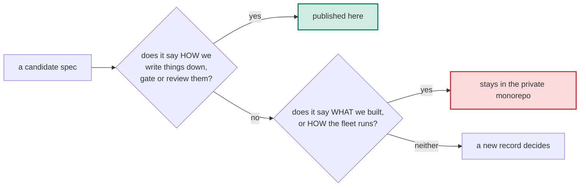

# This repository publishes mechanisms, never a decision's content or the operating playbook

## Context

The first record published this repository and its first spec. The question
that followed, the same day, was what a specs repository may hold before it
leaks what makes the company fast, since a repository of how we operate
"essentially codifies how our business works".

As of 2026-10-06 The private monorepo holds 164 records of architecture,
vendors, sites, credentials and posture, and an operating model in which
agents write most of the code under a model policy, decision tiers, an
orchestrator and a reviewer ensemble. None of that is in this repository. The
one spec here describes how a decision is written down, gated and ratified,
and says nothing about what was decided or how the fleet runs.

## Decision

We will publish only mechanisms: how a thing is written down, gated, versioned
or reviewed, stated so another team can adopt it without learning what we
decided. We will NOT publish a decision's content: the private monorepo's
records, its architecture, vendors, sites, credentials or posture. We will NOT
publish the operating playbook: which model builds or reviews what, who
decides what, how agents are orchestrated, briefed or fanned out. The
condition that reopens the playbook half is a deliberate choice to make the
operating model itself part of the public brand, taken in a superseding
record.

| What | Decided |
|---|---|
| Mechanisms: formats, gates, lifecycles, review shapes | published here |
| A decision's content: records, architecture, vendors, sites, credentials, posture | never |
| The operating playbook: model routing, decision tiers, orchestration, briefs, fan-out | never, until a superseding record makes the operating model the public brand |
| The test for a future spec | "how we write things down" publishes; "what to build or how to run the fleet" does not |
| Counts about the private monorepo, as evidence in a spec | allowed; a count names no decision |

### Options considered

| Option | Why it lost |
|---|---|
| Publish the operating model too, as some companies publish their whole decision process | The agent-heavy operating model is the speed edge, and a recipe for it is the one thing a competitor could copy without the hardware or the execution |
| Publish nothing further | The mechanism was worth publishing the same day it was asked for, and the recruiting and credibility signal is real |
| Decide spec by spec, with no written boundary | An unwritten boundary is re-argued every time, and the next author publishes by default |

## Human intent

> "Um I'm trying to think for the like this essentially codifies how our
> business works which seems to maybe leak the secret sauce but um what are
> your thoughts here"

— Jacob ([@jacob-petterle](https://github.com/jacob-petterle)), pairing session (typed answer to the publishing-surface question), 2026-10-06

Ratification:

> "cool, sounds good, please use our orchestrator skill or something to get
> all of these things deployed as needed through all the various things: the
> infrastructure, the ADRs, etc. And I'm ratifying everything ahead of time."

— Jacob ([@jacob-petterle](https://github.com/jacob-petterle)), pairing session (typed message), 2026-10-06

## Consequences

- Every future spec passes one test before it is drafted, and a reader of this
  repository knows what they will never find in it.
- The most interesting material, how a small team ships with agents, stays
  private, so the credibility signal this repository sends is bounded to
  formats and gates.
- The line needs judgment at the edges: the shape of a review loop is a
  mechanism, its model routing is playbook. This record names the test, not
  every case; an edge case earns its own record.

## References

- Record-carrying PR: https://github.com/perimetercompute/specs/pull/1
- Implementing PR: none expected
