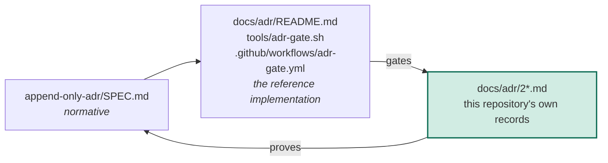

# The ADR mechanism is published as a spec, the first in a public specs repository

## Context

On 2026-10-06 a widely read post asked where the source of truth for how a
piece of software is supposed to work lives, now that agents fix whatever they
touch and keep undoing decisions nobody wrote down. Tests do not carry the fact
that four seemingly valid options were rejected, and "another document" is
another thing that drifts. Our answer is the append-only, human-ratified
decision log our monorepo has run since 2026-07-27, and the question was how
to publish the recipe so other teams can use it.

Three facts shaped the choice. A gist is owned by a person, never by an
organization, so it cannot carry the company's name. The objection in the post
is precisely that a document drifts, so a recipe that is only prose proves
nothing about whether it is still true. And a verbatim copy of our files
describes how we do it, not what a conforming implementation must do; a second
team adopting it would inherit our tooling rather than our rules.

## Decision

We will publish a public repository under the company's GitHub organization
that holds specifications of how we operate, one directory per spec. The ADR
mechanism is the first, written as a normative, tool-agnostic specification
with RFC 2119 keywords and conformance levels. The repository itself conforms
to every spec it publishes: its own decisions are records in its own
`docs/adr/`, gated by the reference implementation it ships. This record is
the first.

| What | Decided |
|---|---|
| Container | one public repository of specs under the organization, not one repository per spec |
| Form of each spec | normative and tool-agnostic: terms, MUST/SHOULD requirements, conformance levels; tooling only in a non-normative appendix |
| Proof | the repository's own records pass the gate it ships, in its own CI |
| What stays out | tooling specific to our monorepo: the build system, the per-package enrollment, the merge-queue wiring |
| License | MIT |

### Options considered

| Option | Why it lost |
|---|---|
| A gist | Owned by a person, not the organization; no CI, so the gate cannot be shown running on the recipe; no directories, so `docs/adr/` cannot even be laid out |
| A verbatim copy of our files in a single-purpose repository | Describes how we do it, not what conformance requires; the next spec would need a second repository, and the name would go stale |
| A blog post or thread | Prose only. It is exactly the "another document that drifts" the post objects to, and nothing in it is copyable |
| A directory inside the private monorepo, shared by link | Unreadable to anyone outside the organization |

## Human intent

> "I'm curious if you, if you could, if we have like a recipe here, we could
> just post about how we do our ADRs and kind of how we operate our repo here.
> So I think this is really interesting that we're kind of ahead of the curve
> on this. [...] I'm trying to think of the best format to send this to them.
> If it's like a gist that we can easily upload as a spec essentially for
> building this type of ADR mechanism, [...] or if it's something else because
> I'd love to put a gist on Primer Computes Enterprise or something that people
> can reference"

("Primer Computes" is the speech-to-text rendering of the company name. Left
as spoken: a record that silently cleans its decider's words asserts a
provenance it cannot support.)

— Jacob ([@jacob-petterle](https://github.com/jacob-petterle)), pairing session (voice; speech-to-text output, transcription artifacts left as spoken), 2026-10-06

> "what are your thoughts? is this perimeter compute specs repo? it shoudl be
> generalized though into a spec not verbatum what are you're thoughts"

— Jacob ([@jacob-petterle](https://github.com/jacob-petterle)), pairing session (typed answer to the format question), 2026-10-06

Ratification:

> "Sorry, I meant like specs we can have multiple specs in one repo. And then
> let's publish the repo. Actually, we do repos through how do we do this? It's
> through our GitHub infrastructure as code. So we might need to publish,
> create the repo, and then I think we have to lock it in in code.
>
> I can't remember exactly what we do."

— Jacob ([@jacob-petterle](https://github.com/jacob-petterle)), pairing session (typed answer to the ratification question), 2026-10-06

## Consequences

- Anyone can read the spec, claim a conformance level, and copy three paths
  to reach Level 2.
- The spec cannot drift silently: the gate runs on this repository's own
  records on every push, and a change to the spec rides a ratified record.
- A public repository is a maintained surface. Issues and pull requests will
  arrive, and declining them costs attention a gist would never have asked for.
- The first record was ratified before the first push, so the repository
  launches green; every later record goes through the red-by-design flow.

## References

- Record-carrying change: the initial commit of this repository
- Implementing PR: none expected
