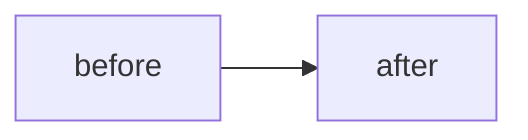

# Architecture Decision Records

This directory is a conforming implementation of the
[append-only-adr spec](../../append-only-adr/SPEC.md), at Level 2. The rules
below are the spec's requirements as this repository applies them; the
reasoning behind each lives in the spec.

The append-only decision log for this repository. A record is the history of
deciding: the context, the options, the consequences, and the decider's exact
words. Once a record merges to `main` it is immutable. The log's value is that
a reference into it can never dangle and its bytes can never be quietly
rewritten.

**Records are the one surface in the repository that proves a human decided
something.** Code, comments, tickets and agent instructions are mostly
agent-written and freely edited, so nothing about them proves intent. A record
proves exactly that: verbatim ratified words, append-only bytes, and a gate
that blocks the merge until the decider speaks. Read everything else as
current mechanics. Read a record as intent.

## Rules

1. **Append-only.** A merged record is never edited, renamed or deleted. A
   change of mind is a NEW record carrying `supersedes:` with the old record's
   id. The old record is never written back; its superseded-ness is derived
   from the new record's front matter.
2. **Filenames are `YYYYMMDD-slug.md`; the id is the filename stem.** Never
   sequence numbers: parallel authors collide on `NNNN`, and under append-only
   a collision is frozen forever. The filename date is the day the draft was
   minted; front-matter `date:` is when the human decided.
3. **A record lives directly in a `docs/adr/` directory.** The central one
   for anything cross-cutting; a package's own `<pkg>/docs/adr/` when exactly
   one package owns the decision. Nothing else lives in an ADR directory,
   because everything there freezes on merge.
4. **Agents never decide.** An agent drafts `status: proposed` on a branch and
   stops. The decider's ratifying words land verbatim under Human intent, the
   status flips to `accepted` in the same PR, and only then is the PR
   mergeable. `proposed` never reaches `main`: the gate keeps the PR red until
   the flip, and that red is the system working.
5. **Human intent is verbatim.** A quote, an attribution, a source, a date. A
   paraphrase never substitutes. Speech-to-text artifacts stay as spoken, with
   a note; a record that silently cleans its decider's words asserts a
   provenance it cannot support.
6. **Every record registers in the one central manifest.** From the repo
   root: `shasum -a 256 <path-to-record> > docs/adr/adr-manifest/<id>.txt`
   (`sha256sum` on Linux). One entry file per record, so two PRs registering
   two records never conflict. Entries are append-only too, except to re-hash
   a record that is still a draft on its own branch.
7. **References are commit-SHA permalinks, including references to other
   records.** A branch link rots as the branch moves. Link another record by
   its permalink with the id as the link text, so it is one click from
   anywhere the text gets pasted and still greppable in-repo. Only the
   `supersedes:` front matter stays a bare id, because the gate parses it.
8. **Deciders are humans, named by GitHub handle.** `deciders:` lists bare
   handles; the attribution line links the profile.
9. **`schema:` versions the record format.** A tightened rule bumps the
   version and applies only to records that declare it, because a frozen
   record can never be brought up to a newer schema.

**Statuses.** A record merges as `accepted`, or, for backfilled history only,
as `deprecated`: a decision that was real but had already been retired before
it was recorded. A live record never transitions in place. Retiring a decision
without a replacement is itself a decision, recorded as a new superseding
record; one ratified line of Human intent is enough.

## Reading the log

- **`accepted` means *was ratified*, never *is current*.** Before relying on a
  record, check nothing supersedes it:
  `git grep -l '<id>' -- ':(glob)**/docs/adr/2*.md'`.
- **Context is a snapshot as of `date:`.** A record describes the world at
  decision time and can never be updated. Current rules live in the code and
  in the repository's instruction files, which cite the record that decided
  them.
- **A record can be superseded in part, and only the newer record can say
  so.** The newer record names the retired clause where a reader of it will
  see it before acting. The older record's other decisions stand.

## When to write

**A record is for a true architectural trade-off.** If the code decides it
and the code is clear, a record makes things worse: the code keeps moving, the
frozen record cannot follow, and the reader now holds two sources that
disagree. Three kinds of decision qualify because nothing in code can carry
them:

| Kind | What the Decision says | What it names |
|---|---|---|
| A choice | we will X | the options that lost, and why |
| A rejection | we will NOT X | the condition that would have to change for the answer to change, or none |
| A deferral | we defer X | the invariant locked now, and the concrete trigger that reopens the question |

An unrecorded "no" is indistinguishable from never having considered it, and
the next author proposes X again. That is why rejections and deferrals are
first-class.

**Default: the record rides the PR that implements it**, so a reviewer checks
the decision against the diff and the diff against the decision. Pull a record
ahead of its implementation only when parallel branches must build under the
rule before its own PR merges. Rejections, deferrals and process rules never
have an implementing PR; write them when the decision is made.

## The proposed → accepted flow

1. The agent drafts `docs/adr/YYYYMMDD-slug.md` with `status: proposed`,
   writes its manifest entry, opens the PR, and STOPS. The PR is red. The PR
   body says so, naming the one step that is expected red, so a real failure
   never hides behind the designed one.
2. The human decider ratifies in their own words: a PR comment, a chat
   message, a voice note. The agent quotes those words verbatim under Human
   intent, with the permalink when there is one.
3. The status flips to `accepted` in the same PR, the References are filled
   in, the manifest entry is re-hashed (the record is not on `main` yet, so
   this is a draft edit), and the PR goes green.

## Operating notes

- **Reverting a PR that carried a record:** revert the code only. Restore every
  ADR path the revert touched before committing:
  `git revert -n <sha> && git checkout HEAD -- $(git ls-files --with-tree=HEAD -- ':(glob)**/docs/adr/**') && git commit`.
  The change of mind becomes a superseding record.
- **Redaction** (a secret or personal data merged inside a record): there is
  no in-band path. It is a history rewrite that rots every permalink minted
  after the rewritten commit. Scrub quotes BEFORE merge; pre-merge is the only
  cheap moment that will ever exist.

## Template

Copy this into `docs/adr/YYYYMMDD-slug.md`:

````markdown
---
schema: 1                   # record format version — rule 9
status: accepted            # accepted | deprecated. proposed exists only on branches — rule 4
date: 2026-01-01            # the day the human ratified, not the day an agent drafted
deciders: [jane-doe]        # GitHub handles, humans only; an agent is never a decider
scope: apps/example         # repo-root-relative path of what this governs, or `repo`
supersedes: []              # ids (filename stems) this record revises; empty for new decisions
---

# Short imperative title of the decision

## Context

What forced a decision: the incident, the constraint, the fork in the road.
Two to six sentences. Every factual claim about the code links a commit-SHA
permalink. Write claims as history ("as of 2026-01-01, X"), never as current
truth; this section is a frozen snapshot the moment it merges.

## Decision

We will <one paragraph, active voice, no hedging>.



| What | Decided |
|---|---|
| <the axis, field or component> | <the call> |

### Options considered

| Option | Why it lost |
|---|---|
| <option> | <reason> |

## Human intent

> "The decider's exact words. Verbatim, not a paraphrase. Scrub secrets,
> customer names and personal data BEFORE merge: a merged record cannot be
> redacted."

— Jane ([@jane-doe](https://github.com/jane-doe)), <source: voice note / chat channel / PR review comment (permalink)>, 2026-01-01

## Consequences

- <what gets better>
- <what we accept getting worse: every decision has a cost, and a record with no cost listed is a fairy tale>

## References

- Record-carrying PR: <link>
- Implementing PR: <link, or `none yet`, or `none expected`>
- https://github.com/<org>/<repo>/blob/<40-hex-sha>/path/to/file#L10-L20
````

## Records are visual documents

A record is read by someone deciding whether a rule still applies, usually
months later and in a hurry. Shape goes in a visual; prose carries what a
visual cannot.

| Content | Form |
|---|---|
| A lifecycle, a flow, a who-writes-what, a state machine | a fenced `mermaid` block |
| Options and why each lost | a table, one row per option |
| Before vs after | a two-column table |
| A single constraint, a reason, a trade-off | prose; a diagram of one thing is decoration |

Three rules keep this from making frozen records worse. **The diagram carries
structure; the text carries the facts**, because records get pasted where
mermaid does not render and can never be repaired after merge. **Only markup
GitHub actually renders**: its sanitizer drops `<style>`, `style=`, inline
`<svg>` and event attributes silently, and a stripped tag inside a frozen
record is permanent. **Preview on GitHub's blob view before merge**; that is
the last moment the bytes are editable.

## Enforcement

Three layers, deliberately different in kind. The gate script is
`tools/adr-gate.sh`; the workflow is `.github/workflows/adr-gate.yml`.

| Layer | Where it runs | What it catches | What it cannot |
|---|---|---|---|
| 1. The hermetic gate | every laptop and CI run of `tools/adr-gate.sh` | an edited byte, a deleted record, an unregistered file, a broken schema, a paraphrased Human intent | an edit that also rewrites its manifest entry; it cannot see git |
| 2. The git diff | CI, against the merge-base, on pull request, merge group and push | any modification, rename, type change or deletion under any `docs/adr/`, and any change to an existing manifest entry | nothing a sandbox can forge: the merge-base is not inside the PR |
| 3. The same script under `ADR_GATE_GIT_MODE=1` | CI, same events | a `status: proposed` record on its way to `main` | |

Layer 1 reports `proposed` without failing, because the drafting flow
requires that state on a branch. Failing it hermetically would make the
documented flow uncommittable on any machine that runs the gate before commit,
and teach people to bypass hooks. Layer 3 is the one assertion the layers
split, and it carries no event guard, so a merge queue cannot admit what a
PR-only step would have missed.
